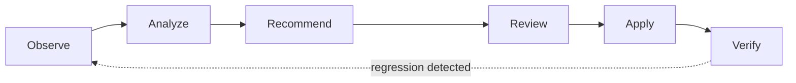

# How Consize Works

Consize turns cost and usage signals into governed, verifiable optimization
actions. Every optimization, whether it's a Kubernetes rightsizing change or
cleaning up an idle cloud resource, moves through the same loop:



- **Observe.** Discovery plugins collect resource inventory and usage
  evidence, for example Kubernetes workload metrics from Prometheus, or
  cloud billing and utilization data.
- **Analyze.** The recommender profiles real usage (CPU/memory p95/p99 over
  a rolling window) rather than relying on static assumptions.
- **Recommend.** A proposed change is generated, along with the evidence
  and reasoning behind it, and optionally enriched with a price estimate.
- **Review.** The policy engine decides what happens next: block, split
  into smaller steps, require approval, or auto-apply, depending on your
  configured guardrails. See [The Safety Net](safety-net.md) for the full
  decision matrix.
- **Apply.** Approved changes are applied gradually. Large changes are
  broken into small, reversible steps rather than applied all at once,
  either as a pull request against your IaC repo or as a guarded runtime
  change.
- **Verify.** Real SLIs (OOM kills, CPU throttling, latency) are monitored
  after every step. A regression triggers an instant, byte-identical
  rollback, no manual intervention required.

## Components

Consize is built from a small set of focused pieces that map directly onto
the loop above:

| Component | Role |
|---|---|
| **Discovery** | Finds resources and collects the evidence (metrics, billing data) needed to analyze them |
| **Recommender** | Turns evidence into a deterministic, reproducible recommendation |
| **Cost enrichment** | Attaches a transparent price estimate to a recommendation, when a pricing source is configured |
| **Policy** | Evaluates every proposed change against your configured guardrails before it's allowed to proceed |
| **Orchestrator** | Applies approved changes step-wise, within configured boundaries |
| **Safety / Verifier** | Watches SLIs after each step and triggers an automatic rollback on regression |
| **Store** | Persists resources, recommendations, and their audit history. See the [Universal Resource Model](../reference/resource-model.md) for how Consize represents infrastructure resources. |
| **Audit** | Records what was observed, recommended, approved, applied, and verified, so every action is traceable |

## Plugin architecture

Discovery, metrics, and pricing sources are pluggable. Consize ships with
built-in plugins for Kubernetes, Prometheus, and cloud pricing, and can load
additional plugins so the same Observe → Verify loop extends to new
resource types and platforms without changing the core engine. See
[Supported Platforms](../reference/supported-platforms.md) for what's
supported today.

## See it end to end

The fastest way to understand the loop is to watch it happen. The
interactive sandbox runs entirely on your machine, no cluster, no cloud
account, just Docker:

```bash
docker run -p 3000:3000 -p 8080:8080 -it ghcr.io/consize-oss/consize-sandbox:latest
```

Open `http://localhost:3000` and watch the Verifier catch an intentional
regression on a seeded `checkout-api` workload and trigger an automatic
rollback in real time.

[Try the Interactive Sandbox](../getting-started/sandbox.md){ .md-button .md-button--primary }

## Next steps

* [The Safety Net](safety-net.md)
* [Kubernetes Rightsizing](../guides/rightsizing.md)
* [Observability](../guides/observability.md)
* [Configuration](../reference/configuration.md)
